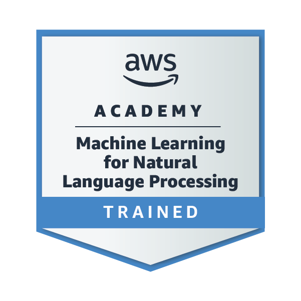
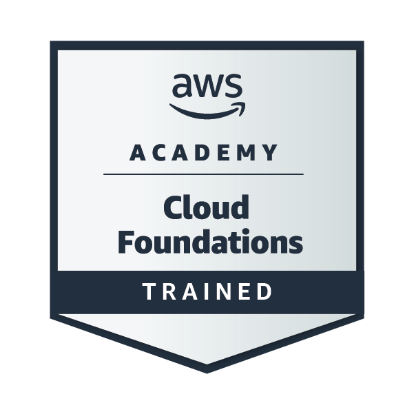

<h1 align="center">Hi there, I'm Nithinbharathi..! 👋</h1>

<p align="center">
  
</p>

---

## 🚀 About Me  

```yaml
🧠 Aspiring System Design Engineer: Focused on designing scalable, high-availability backend systems and distributed architectures.
⚙️ Backend & Infrastructure Engineer: Builds production APIs and data pipelines using Node.js, Python, Fastify, and Flask.
🤖 AI Systems Developer: Develops RAG-based platforms using LLMs (Gemini, Llama), vector databases (pgvector), and orchestration frameworks like LangChain.
📊 Data & Storage Architectures: Works with PostgreSQL, MongoDB, Redis caching, and vector databases for high-performance systems.
🔐 Security-First Developer: Background in penetration testing, vulnerability assessment, and secure system design.
🚀 DevOps & Deployment: Experienced with Docker, CI/CD pipelines, cloud deployments, and automated workflows.
🎯 Open Source Engineer: Maintains multiple production-ready repositories with a focus on scalable backend architecture.
``` 

---

## 🏆 Skill Zone

<p align="center">
  <a href="#">
    
  </a>
</p>

---

## 💡 Featured Projects  

<p align="center">
  <a href="https://github.com/nithinbharathi-t/rag-incident-responder">
    
  </a>
  <br>
  <sub>
  Enterprise-grade SRE platform using Retrieval-Augmented Generation (RAG) to automatically analyze production logs and generate grounded remediation steps. Built a high-throughput monitoring pipeline with Redis sliding windows and vector search for causal incident analysis.
  </sub>
</p>

<p align="center">
  <a href="https://github.com/nithinbharathi-t/zentellect">
    
  </a>
  <br>
  <sub>
  Adaptive AI learning platform that converts PDFs into structured courses using RAG pipelines. Includes a live coding environment via Piston API and an automated AI test generation engine for evaluating programming solutions.
  </sub>
</p>

<p align="center">
  <a href="https://github.com/nithinbharathi-t/Study-Sync-AI">
    
  </a>
  <br>
  <sub>
  AI-powered productivity platform that generates personalized study schedules and assessments using Google Gemini. Built a full-stack architecture with Supabase PostgreSQL, Prisma ORM, and analytics-driven task tracking.
  </sub>
</p>

<p align="center">
  <a href="https://github.com/nithinbharathi-t/SustainableEV">
    
  </a>
  <br>
  <sub>
  Intelligent EV trip planning system that analyzes vehicle data and charging infrastructure to recommend optimized routes. Implemented AI-driven decision workflows using n8n automation and Gemini-powered travel reasoning.
  </sub>
</p>

---
---

## ⚡ GitHub Stats

<p align="center">
  
  
</p>

---

## 🌟 Professional Journey

🛠️ **Techsnapie Solutions – Coimbatore**

* 🚀 *Development Team Lead* (Nov 2024 – Jul 2025)
  ▸ Led a 6-member team delivering RESTful APIs for enterprise projects
  ▸ Improved backend response time by **20%** using optimized API design
* 🛡️ *Penetration Tester* (Aug 2024 – Oct 2024)
  ▸ Identified and mitigated **15+ client-side security vulnerabilities**
* 💻 *Web Developer* (May 2023 – Jul 2024)
  ▸ Delivered **7+ client solutions**, improving performance by **30%**

---

🔐 **IBM & Edunet Foundation Internship** *(Jan – Feb 2025)*

* Completed **40+ hours** of hands-on cybersecurity labs
* Worked on incident response, IT risk management, and threat mitigation

---

🎯 **Hackathons & Leadership**

* 🏆 Smart India Hackathon – Campus Finalist
* 🏅 SAP Hackathon – Level-2 Qualifier
* 🚀 NASA Space App Challenge Participant
* 🕹️ Organized **CTF competitions**
* 👨‍🏫 Mentored **250+ students**
* 📈 GitHub **C+ Rank Contributor**

---

## 🎓 Certifications

## 🎓 Certifications & Badges

<table>
  <tr>
    <td align="center">
      <a href="https://www.credly.com/badges/a2740beb-1eee-48cf-91a9-c99b6a2e2f6f/public_url">
        <br />
        <sub><b>AWS Academy Graduate - Machine Learning for Natural Language Processing</b></sub>
      </a>
    </td>
    <td align="center">
      <a href="https://www.credly.com/badges/96fc4146-ca94-4ea4-8716-c46cfabe7dc8/public_url">
        <br />
        <sub><b>AWS Academy Graduate - Cloud Foundations</b></sub>
      </a>
    </td>
  </tr>
</table>

<br/><br/>

* **Cloud & AI Engineering**
  * AWS Academy – Cloud Foundations
  * AWS Academy – Generative AI Foundations
  * Microsoft Security Copilot
* **Cybersecurity & Infrastructure**
  * IBM Cybersecurity Fundamentals
  * Cisco Introduction to Cybersecurity
  * Microsoft Cybersecurity Career Essentials
* **Software Engineering & DevOps**
  * NASBA DevOps Foundations (DevSecOps)
  * Cisco Python Essentials
  * Python Automation & Tool Development 

---

## 🤝 Let's Connect

<p align="left">
  <a href="https://www.linkedin.com/in/nithinbharathi/" target="_blank">
    
  </a>
  &nbsp;&nbsp;
  <a href="mailto:nithinbharathi9325@gmail.com">
    
  </a>
  &nbsp;&nbsp;
  <a href="https://github.com/nithinbharathi-t" target="_blank">
    
  </a>
</p>

---

🎯 **"Build secure systems. Ship real products. Leave clean commits."**

